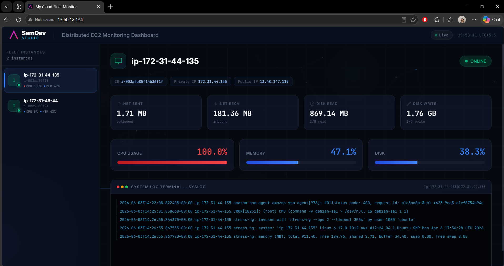

# Cloud Fleet Monitor 🚀

A real-time, distributed telemetry and fleet monitoring dashboard designed for AWS EC2 clusters. This project provides full-stack visibility into system performance metrics without relying on heavy third-party monitoring packages. It uses a WebSocket-based architecture for instant telemetry streaming and features a premium sci-fi themed frontend dashboard.



## Tech Stack
* **Backend**: FastAPI, Uvicorn, WebSockets (Asynchronous Python server)
* **Agent**: Python (`psutil`, `websockets`, `requests`) running as a managed `systemd` daemon
* **Frontend**: Clean HTML5/CSS3, JavaScript (WebSockets API), Nginx
* **Deployment**: Fully automated bash automation via scripts

---

## Architecture Overview

The system consists of three core components:
1. **Central Monitoring Backend (FastAPI)**: Serves as the WebSocket coordinator, receiving metrics from EC2 agents and broadcasting them to dashboard clients.
2. **Sci-Fi Frontend Dashboard (HTML5/CSS3/JS)**: A modern, visually stunning dashboard that displays fleet-wide statistics, detailed node metrics, and system log streams in real-time.
3. **Telemetry Daemon Agent (Python)**: Deployed on each EC2 instance to collect metrics, securely retrieve AWS metadata via IMDSv2, and stream updates.

```
                      +-----------------------------+
                      |       Monitored EC2s        |
                      |  [Telemetry Agent Daemon]   |
                      +--------------+--------------+
                                     |
                         WebSocket   | (Port 8080 /agent)
                                     v
                      +--------------+--------------+
                      |  Central Monitoring Server  |
                      |      [FastAPI Backend]      |
                      +--------------+--------------+
                                     |
                         WebSocket   | (Port 8080 /dashboard)
                                     v
                      +--------------+--------------+
                      |      Frontend Client        |
                      |   [Nginx Web Dashboard]     |
                      +-----------------------------+
```

---

## Technical Component Details

### 1. Central Backend Server (`agent/server.py`)
Exposes WebSocket endpoints to manage bi-directional communication:
- `/agent`: Receives payload metrics from active agents. Keeps an in-memory repository of agent states, timestamps, and status ("ONLINE" / "OFFLINE").
- `/dashboard`: Pushes fleet state updates to active frontend dashboards.
- Built using **FastAPI** and served with **Uvicorn**.

### 2. Premium Frontend Dashboard (`frontend/index.html` & `website.html`)
Designed for an exceptional user experience, featuring:
- **Sci-Fi Styling**: Dark mode palette, custom canvas particle networking background, animated scanning lines, and a smooth cursor-following neon glow.
- **Resource Gauges**: Live linear charts for CPU, Memory, and Disk usage with dynamic color-coding (Blue: Normal, Amber: Moderate, Red: Critical).
- **Network & Disk I/O Cards**: Track inbound/outbound packets and active disk read/write throughput in bytes.
- **System Log Terminal**: A simulated terminal window streaming raw `/var/log/syslog` messages from the active instance.

### 3. Telemetry Agent Daemon (`scripts/setup-backend.sh` -> `agent.py`)
Runs as a background daemon on monitored EC2 nodes:
- Uses **IMDSv2** (Instance Metadata Service v2) to fetch AWS metadata (Instance ID, Private IP, and Public IP) securely using short-lived session tokens.
- Obtains telemetry metrics using `psutil` and queries the last five lines of the local `/var/log/syslog` file.
- Dispatches metrics every 3 seconds to the server and handles connection retry backoff logic.

---

> [!WARNING]
> **Script Naming Mismatch**:
> Please note the following nominal mismatch in the deployment script filenames:
> - `scripts/setup-agent.sh` sets up the **Central Backend Server** & **Frontend Dashboard**.
> - `scripts/setup-backend.sh` sets up the **Client Monitoring Agent Daemon** on client instances.

---

## Telemetry Payload Format

Agents push updates to the backend using the following JSON schema:

```json
{
  "instance_id": "i-0abcd1234efgh5678",
  "public_ip": "54.210.45.90",
  "hostname": "production-web-node-01",
  "private_ip": "172.31.24.112",
  "cpu": 14.2,
  "memory": 62.8,
  "disk": 44.5,
  "network_sent": 12589024,
  "network_recv": 45192011,
  "disk_read": 1048576,
  "disk_write": 2097152,
  "logs": [
    "Jun 03 19:46:01 production-web-node-01 CRON[1284]: (root) CMD (command)",
    "Jun 03 19:46:12 production-web-node-01 systemd[1]: Started Custom Monitoring Agent."
  ]
}
```

---

## Deployment & Setup Guide

Follow these steps to deploy the monitoring stack across your infrastructure.

### Step 1: Deploy the Central Monitoring Server

1. Provision a central Linux instance (Ubuntu recommended) to act as the server.
2. Copy `scripts/setup-agent.sh` to this instance.
3. Run the installer script with sudo privileges:
   ```bash
   sudo chmod +x setup-agent.sh
   sudo ./setup-agent.sh
   ```
4. This script installs system dependencies, deploys the FastAPI server to `/opt/monitoring-server`, starts the `monitoring-backend.service` systemd service on port `8080`, and places the frontend code under Nginx's web folder (`/var/www/html`).

### Step 2: Configure the Frontend WebSocket

1. Edit the frontend file `/var/www/html/index.html` on your server.
2. Find the WebSocket initialization line (around line 1383):
   ```javascript
   const socket = new WebSocket('ws://<!--public-instance-ip-->:8080/dashboard');
   ```
3. Replace `<!--public-instance-ip-->` with the public IP address or public DNS of your Central Monitoring Server.
4. Restart Nginx to apply changes:
   ```bash
   sudo systemctl restart nginx
   ```

### Step 3: Deploy Telemetry Agents on EC2 Instances

1. Copy `scripts/setup-backend.sh` to the target EC2 instances you wish to monitor.
2. Edit the script to configure the central server location. Update line 23 with your central server's public IP:
   ```bash
   MONITOR_SERVER = "<Agent-Server-Public-IP>"
   ```
3. Run the agent installer with sudo privileges:
   ```bash
   sudo chmod +x setup-backend.sh
   sudo ./setup-backend.sh
   ```
4. The script sets up a virtual environment, writes the daemon script to `/opt/custom-monitor-agent/agent.py`, and launches the `custom-monitor-agent.service` systemd service, which will automatically restart on boot.

---

## Troubleshooting & Commands

### Verify Backend Service Status (on Monitoring Server)
```bash
sudo systemctl status monitoring-backend
```

### View Backend Logs (on Monitoring Server)
```bash
sudo journalctl -u monitoring-backend -f
```

### Verify Agent Service Status (on Monitored EC2 Instance)
```bash
sudo systemctl status custom-monitor-agent
```

### View Agent Logs (on Monitored EC2 Instance)
```bash
sudo journalctl -u custom-monitor-agent -f
```
